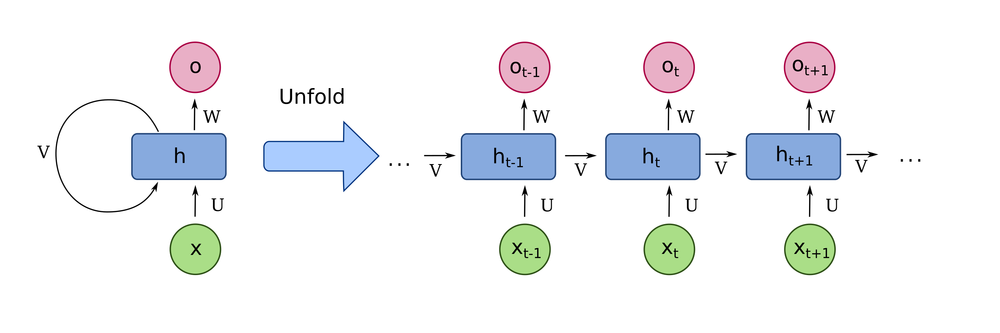
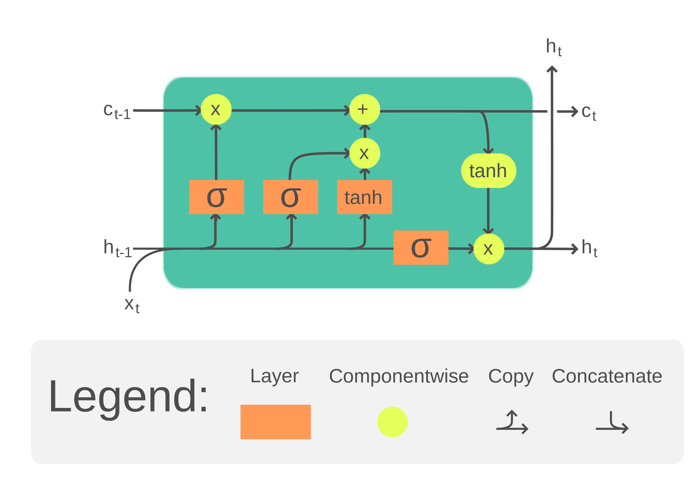
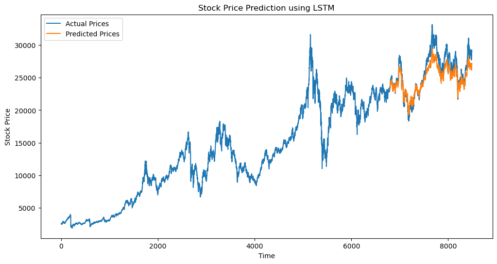

# Redes Neurais LSTM com PyTorch
Descubra os mecanismos internos das redes LSTM e sua capacidade de modelar efetivamente dependências de longo prazo em dados sequenciais. Seja para aplicações em processamento de linguagem natural, análise de séries temporais ou modelagem preditiva.

# Breve visão sobre Redes Neurais Recorrentes (RNN)
As Redes Neurais Recorrentes (RNNs) são uma classe de modelos de rede neural artificial que têm a capacidade de lidar com dados sequenciais e temporais. Elas foram desenvolvidas para superar as limitações das redes neurais tradicionais, que tratam cada entrada de forma independente, sem levar em consideração a ordem ou a dependência temporal dos dados.

O conceito de RNN surgiu na década de 1980, com a ideia de conectar neurônios em uma rede em loops, permitindo que as informações fossem persistentes ao longo do tempo. No entanto, as RNNs tradicionais enfrentavam desafios de treinamento devido ao problema do gradiente que desaparece ou explode, especialmente em sequências longas. Isso resultava em dificuldades para capturar dependências de longo prazo e limitava seu desempenho em tarefas complexas.



# LSTM - Long Short-Term Memory
Para abordar essas limitações, as LSTMs (Long Short-Term Memory) foram propostas no final da década de 1990 por Hochreiter e Schmidhuber. As LSTMs são uma extensão das RNNs que introduzem unidades de memória especiais chamadas "células de memória". Essas células de memória têm a capacidade de armazenar informações por longos períodos de tempo e decidir quando atualizar ou esquecer essas informações, permitindo que as LSTMs capturem dependências de longo prazo de forma mais eficaz.



Com a introdução das LSTMs, as RNNs foram capazes de superar muitas das limitações que as impediam de lidar com sequências complexas e de longo prazo. As LSTMs se tornaram uma arquitetura fundamental em áreas como processamento de linguagem natural, reconhecimento de fala, previsão de séries temporais e muito mais, demonstrando sua eficácia em lidar com uma variedade de problemas de modelagem sequencial.

## Topologia da Rede
**Camada de Entrada**: Esta é a primeira camada da rede, responsável por receber e processar os dados de entrada inicialmente.

**Camada Oculta**: A camada oculta da LSTM é composta por células de memória e unidades de portas. As células de memória têm a capacidade de armazenar informações importantes por longos períodos, permitindo que a rede aprenda padrões complexos ao longo do tempo. As unidades de portas, por sua vez, controlam o acesso e a manipulação dessas informações armazenadas.

**Camada de Saída**: Esta é a última camada da rede, onde as informações processadas são transmitidas como resultado. Aqui, a rede LSTM utiliza o conhecimento adquirido para tomar decisões ou gerar previsões.

# 

# Exemplo de implementação
Objetivo: Prever o valor de fechamento de uma ação.

```python
import torch
import torch.nn as nn
import numpy as np
import pandas as pd
import matplotlib.pyplot as plt
from sklearn.preprocessing import MinMaxScaler

# Carregar os dados
data = pd.read_csv('stock_price.csv')

# Pré-processamento dos dados
prices = data['Close'].values.astype(float)
prices = prices.reshape(-1, 1)  # Reshape para (n_samples, 1)

# Normalização dos dados
scaler = MinMaxScaler(feature_range=(-1, 1))
prices_normalized = scaler.fit_transform(prices)

# Dividir os dados em sequências de entrada e saída
def create_sequences(data, seq_length):
    sequences = []
    for i in range(len(data) - seq_length):
        seq = data[i:i+seq_length]
        label = data[i+seq_length]
        sequences.append((seq, label))
    return sequences

seq_length = 10
sequences = create_sequences(prices_normalized, seq_length)

# Dividir os dados em conjuntos de treinamento e teste
split_ratio = 0.8
split = int(split_ratio * len(sequences))
train_data = sequences[:split]
test_data = sequences[split:]

# Definir o modelo LSTM
class LSTMModel(nn.Module):
    def __init__(self, input_size, hidden_size, output_size):
        super(LSTMModel, self).__init__()
        self.lstm = nn.LSTM(input_size, hidden_size, batch_first=True)
        self.fc = nn.Linear(hidden_size, output_size)
        
    def forward(self, x):
        out, _ = self.lstm(x)
        out = self.fc(out[:, -1, :])
        return out

input_size = 1
hidden_size = 32
output_size = 1
model = LSTMModel(input_size, hidden_size, output_size)

# Definir a função de perda e otimizador
criterion = nn.MSELoss()
optimizer = torch.optim.Adam(model.parameters(), lr=0.001)

# Treinar o modelo
num_epochs = 20
for epoch in range(num_epochs):
    for seq, labels in train_data:
        seq = torch.FloatTensor(seq).unsqueeze(0)
        labels = torch.FloatTensor(labels)
        
        optimizer.zero_grad()
        output = model(seq)
        loss = criterion(output, labels)
        loss.backward()
        optimizer.step()
    
    print(f'Epoch [{epoch+1}/{num_epochs}], Loss: {loss.item()}ß')

# Avaliar o modelo
model.eval()
predictions = []
with torch.no_grad():
    for seq, _ in test_data:
        seq = torch.FloatTensor(seq).unsqueeze(0)
        pred = model(seq).item()
        predictions.append(pred)

# Desnormalizar as previsões
predictions = scaler.inverse_transform(np.array(predictions).reshape(-1, 1))

# Plotar os resultados
plt.figure(figsize=(12, 6))
plt.plot(data['Close'].values, label='Actual Prices')
plt.plot(np.arange(split+seq_length, len(data['Close'])), predictions, label='Predicted Prices')
plt.title('Stock Price Prediction using LSTM')
plt.xlabel('Time')
plt.ylabel('Stock Price')
plt.legend()
plt.show()
````



# Referências
Hochreiter, S., & Schmidhuber, J. (1997). Long Short-Term Memory. Neural Computation, 9(8), 1735–1780. doi:10.1162/neco.1997.9.8.1735 

Sak, H.; Senior, A.; Beaufays, F. Long Short-Term Memory Based Recurrent Neural Network Architectures for Large Vocabulary Speech Recognition. ArXiv preprint arXiv:1402.1128, 2014. Disponível em: https://arxiv.org/abs/1402.1128.

"Recurrent neural network." Wikipedia: The Free Encyclopedia. Wikimedia Foundation, 27 mar. 2024. Disponível em: https://en.wikipedia.org/wiki/Recurrent_neural_network.

"Long short-term memory." Wikipedia: The Free Encyclopedia. Wikimedia Foundation, 3 abr. 2024. Disponível em: https://en.wikipedia.org/wiki/Long_short-term_memory.

PYTORCH. torch.nn.LSTM. Disponível em:  
https://pytorch.org/docs/stable/generated/torch.nn.LSTM.html.  
Acesso em: 06/04/2024.